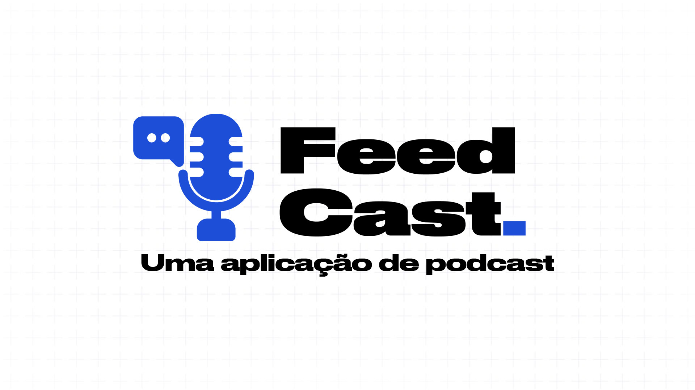

# Feedcast API

Projeto desenvolvido como entrega da Sprint 1 da disciplina de Full-Stack Básico da Pós-Graduação em Engenharia de Software da PUC-Rio.



## Como executar

Será necessário ter todas as libs python listadas no `requirements.txt` instaladas.
Após clonar o repositório, é necessário ir ao diretório raiz, pelo terminal, para poder executar os comandos descritos abaixo.

> É fortemente indicado o uso de ambientes virtuais do tipo [virtualenv](https://virtualenv.pypa.io/en/latest/installation.html).

```
(env)$ pip install -r requirements.txt
```

Este comando instala as dependências/bibliotecas, descritas no arquivo `requirements.txt`.

Para executar a API basta executar:

```
(env)$ flask run --host 0.0.0.0 --port 5000
```

Em modo de desenvolvimento é recomendado executar utilizando o parâmetro reload, que reiniciará o servidor
automaticamente após uma mudança no código fonte.

```
(env)$ flask run --host 0.0.0.0 --port 5000 --reload
```

Abra o [http://localhost:5000/#/](http://localhost:5000/#/) no navegador para verificar o status da API em execução.

## Dados para utilizar para testar aplicação

### Feeds

Para testar a função de importação via feed `/importacoes/feed-rss` você pode usar os seguintes feeds:

- Não Inviabilize: https://anchor.fm/s/44064584/podcast/rss
- NerdCast: https://api.jovemnerd.com.br/feed-nerdcast/

### Episódios

Você pode usar as informações abaixo para fazer o teste relacionado aos endpoints de episódio:

```json
{
  "audio": "https://chrt.fm/track/GD6D57/https://nerdcast.jovemnerd.com.br/nerdcast_945_wow_20_anos.mp3",
  "capa": "https://uploads.jovemnerd.com.br/wp-content/uploads/2024/08/nc945_wow_20_anos_3000x3000px__1u8q1j8.jpg",
  "descricao": "Pela Aliança ou pela Horda?",
  "titulo": "NerdCast 945 - World of Warcraft: 20 anos de jogatina"
}
```

```json
{
  "audio": "https://chrt.fm/track/GD6D57/https://nerdcast.jovemnerd.com.br/nerdcast_944_houseofdragon2.mp3",
  "capa": "https://uploads.jovemnerd.com.br/wp-content/uploads/2024/08/nc944_house_dragon_2_3000x3000px__i047ve.jpg",
  "descricao": "De que lado você está?",
  "titulo": "NerdCast 944 - House of the Dragon: dancem, dragões, dancem!"
}
```
